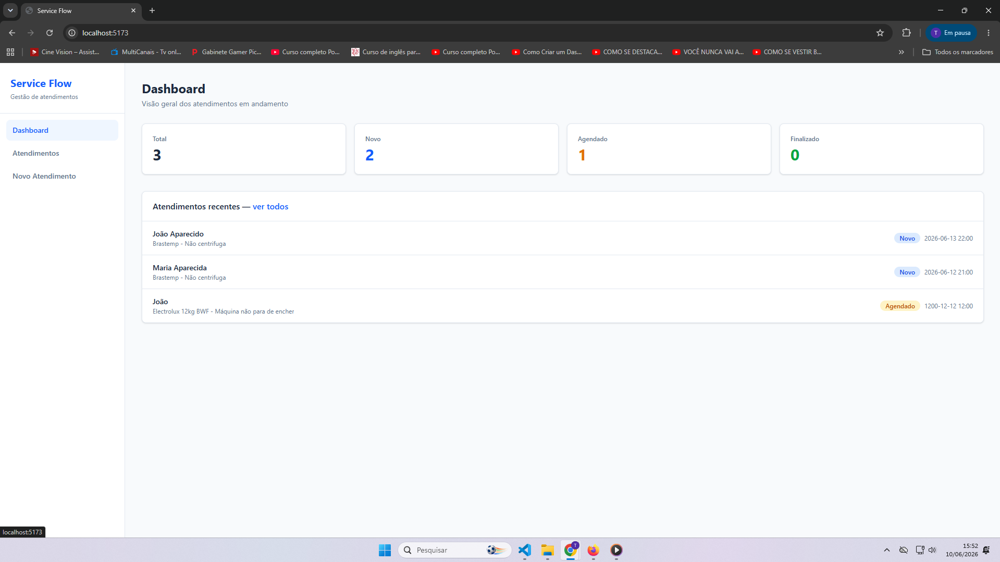
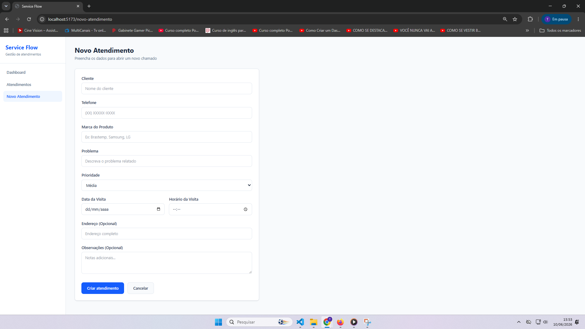
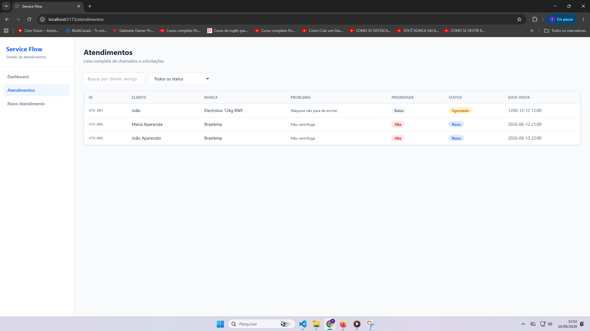
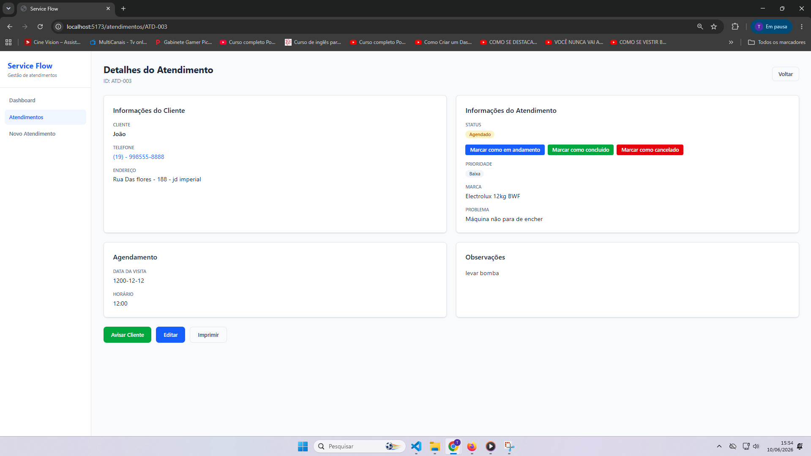

# 🚀 Service Flow



<br>

Sistema web para gerenciamento de atendimentos de uma assistência técnica de máquinas de lavar roupa.

Desenvolvido utilizando React, TypeScript, Vite e Tailwind CSS, com foco em organização, produtividade e preparação para futuras integrações com APIs e automações utilizando n8n.

---

## 📸 Preview do Sistema

### Dashboard


---

### Novo Atendimento



---

### Lista de Atendimentos



---

### Detalhes do Atendimento



---

## 📋 Sobre o Projeto

O Service Flow foi criado para auxiliar técnicos de assistência técnica no gerenciamento diário de clientes, visitas e atendimentos.

A aplicação utiliza dados mockados para simular um ambiente real de operação, mantendo uma arquitetura preparada para futuras integrações com APIs, banco de dados e fluxos automatizados.

---

## ✨ Funcionalidades

### Dashboard

- Visualização rápida dos indicadores principais
- Visitas agendadas para o dia
- Clientes aguardando retorno
- Serviços finalizados
- Atendimentos cancelados

### Gestão de Atendimentos

- Cadastro de novos atendimentos
- Atualização de informações
- Controle de status
- Histórico de atendimento

### Pesquisa e Filtros

- Busca por cliente
- Filtro por status
- Filtro por bairro

### Detalhamento

- Visualização completa dos dados do cliente
- Informações da máquina
- Histórico de atendimento
- Alteração de status

---

## 🛠 Tecnologias Utilizadas

- React
- TypeScript
- Vite
- Tailwind CSS
- React Router DOM
- React Hook Form
- Axios

---

## 📂 Estrutura do Projeto

```bash
src/
├── components/
├── hooks/
├── layouts/
├── mock/
├── pages/
├── routes/
├── services/
└── types/
```

---

## ⚙️ Executando o Projeto

Clone o repositório:

```bash
git clone https://github.com/TaalesPorjanDev/service-flow.git
```

Acesse a pasta:

```bash
cd service-flow
```

Instale as dependências:

```bash
npm install
```

Execute o projeto:

```bash
npm run dev
```

A aplicação estará disponível em:

```bash
http://localhost:5173
```

---

## 📜 Scripts Disponíveis

```bash
npm run dev
```

Executa o projeto em modo desenvolvimento.

```bash
npm run build
```

Gera a build de produção.

```bash
npm run preview
```

Visualiza a build localmente.

---

## 🔌 Preparado para Integrações Futuras

O projeto foi estruturado para facilitar integrações futuras com:

- APIs REST
- Banco de dados
- Webhooks
- n8n
- WhatsApp Business
- Sistemas de CRM
- Dashboards analíticos

O arquivo:

```bash
src/services/api.ts
```

já está preparado para substituir os dados mockados por chamadas reais utilizando Axios.

---

## 🚀 Possíveis Evoluções

- Sistema de autenticação
- Controle de usuários
- Banco de dados
- Integração com WhatsApp
- Notificações automáticas
- Integração com n8n
- Dashboard com gráficos
- Controle financeiro
- Histórico completo por cliente

---

## 👨‍💻 Autor

**Tales Porjan**

GitHub:
https://github.com/TaalesPorjanDev
